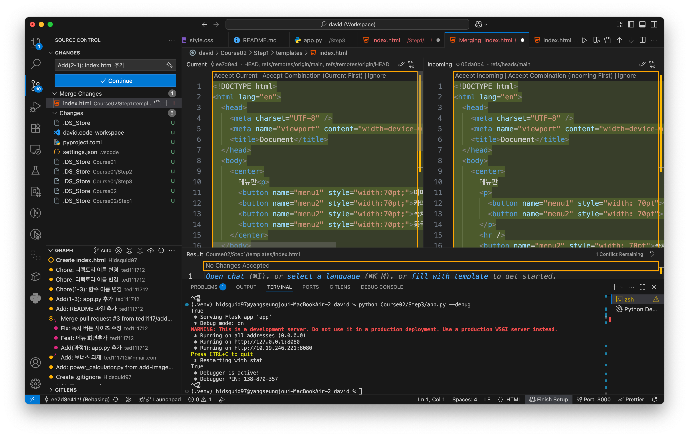

# 협업 시 충돌
## 단계
1. 로컬에서 파일 수정 후 커밋
2. 웹에서 파일 수정 후 커밋 및 푸시
3. 로컬에서 push -> 오류 발생

## 해결
1. 일단 로컬에서 pull  
```git pull --rebase origin main```
2. 충돌 해결

3. 커밋
```bash
git add ...
git rebase --continue
```
4. 푸시  
```git push -u origin main```
