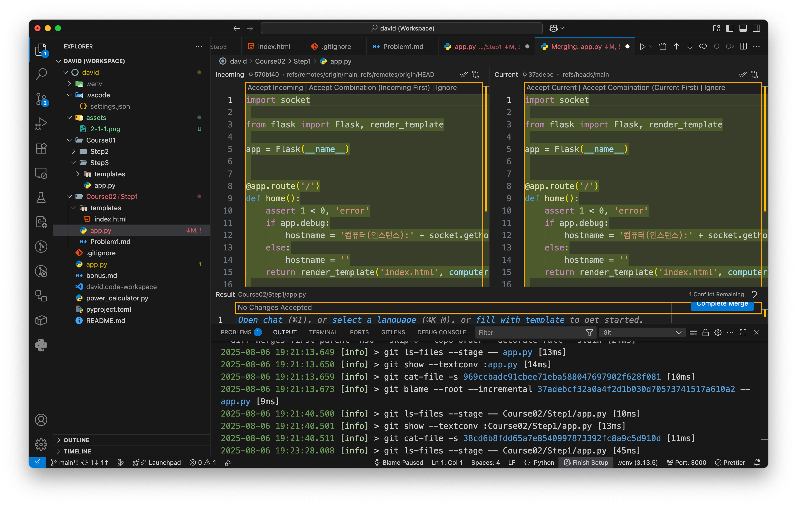

# 동일 위치 충돌
## 단계
1. 같은 파일을 로컬과 원격에서 같은 위치에 다른 함수 추가
2. 충돌
3. resolve 후 push

## 해결
1. git pull 충돌
```bash
git pull
remote: Enumerating objects: 9, done.
remote: Counting objects: 100% (9/9), done.
remote: Compressing objects: 100% (4/4), done.
remote: Total 5 (delta 1), reused 0 (delta 0), pack-reused 0 (from 0)
오브젝트 묶음 푸는 중: 100% (5/5), 1.35 KiB | 230.00 KiB/s, 완료.
https://github.com/ted1117/david URL에서
b86540a..570bf40 main -> origin/main
힌트: You have divergent branches and need to specify how to reconcile them.
힌트: You can do so by running one of the following commands sometime before
힌트: your next pull:
힌트:
힌트: git config pull.rebase false # merge
힌트: git config pull.rebase true # rebase
힌트: git config pull.ff only # fast-forward only
힌트:
힌트: You can replace "git config" with "git config --global" to set a default
힌트: preference for all repositories. You can also pass --rebase, --no-rebase,
힌트: or --ff-only on the command line to override the configured default per
힌트: invocation.
fatal: Need to specify how to reconcile divergent branches.
```
2. git pull --no-rebase (merge 방식)
```bash
hidsquid97@yangseungjoui-MacBookAir-2 david % git pull --no-rebase
자동 병합: Course02/Step1/app.py
충돌 (내용): Course02/Step1/app.py에 병합 충돌
자동 병합이 실패했습니다. 충돌을 바로잡고 결과물을 커밋하십시오.
```
3. vscode에서 conflict resolve

4. 커밋 후 push
```bash
hidsquid97@yangseungjoui-MacBookAir-2 david % git add Course02/Step1/app.py
hidsquid97@yangseungjoui-MacBookAir-2 david % git commit -m "Fix(2-1): test1, te
st2 충돌 수정"
[main b72516b] Fix(2-1): test1, test2 충돌 수정
hidsquid97@yangseungjoui-MacBookAir-2 david % git push -u origin main
오브젝트 나열하는 중: 18, 완료.
오브젝트 개수 세는 중: 100% (18/18), 완료.
Delta compression using up to 8 threads
오브젝트 압축하는 중: 100% (8/8), 완료.
오브젝트 쓰는 중: 100% (10/10), 1.17 KiB | 1.17 MiB/s, 완료.
Total 10 (delta 3), reused 0 (delta 0), pack-reused 0
remote: Resolving deltas: 100% (3/3), completed with 1 local object.
To https://github.com/ted1117/david.git
570bf40..b72516b main -> main
branch 'main' set up to track 'origin/main'.
```